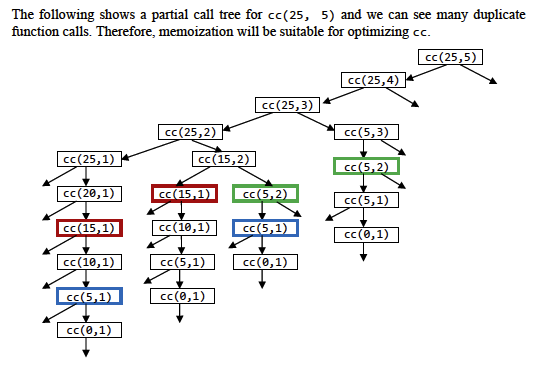

# Week 10 Studio

---

### Agenda

- Arrays and Loops
- Sorting & Recursion problems with loops
- Arrays & Loops in Environment Model
- Studio Sheet

---

### Some Announcements

- Reading Assessment 2
- Studio 11 is during public holiday
- Returning of robot kits after studio
- Practical Assessment

---

### Arrays

- Data structure that stores a sequence of data elements
- Elements in an array are accessed through indices. 
    - The first element has an index of 0.
    - Accessing an element of an array by its index is $O(1)$. This is a very useful property that helps with a lot of problems.

```javascript
const seq = [10, 5, 8];
seq[0]; // 10
seq[2]; // 8
```

----

### Arrays

- Elements of an array can be reassigned. This implies that an array is a mutable object.

```javascript
const seq = ["hello"];
seq[0] = 100;
seq[0]; // 100
``` 

- Elements can be assigned to any position in the array. Assigning an element to an index after the last element of the array will increase the size of the array.

```javascript
const seq = ["hello"];
seq[3] = 100;
seq; // ["hello", , , 100]
array_length(seq); // 4
```

---

### Loops

- 2 kinds of loops: `while` and `for` loops

```javascript
// while loop
let count = 10;
while (count > 0) {
    // do something
    count = count - 1;
}

// for loop
for (let count = 10; count > 0; count = count - 1) {
    // do something
}
```

----

### Loops

- Many of our recursion problems can also be solved with loops. Try implementing them yourself!
    - Factorial
    - Square root
    - Power function
    - Fibonacci
    - Greatest common divisor (GCD)
    - Least common multiple (LCM)
    - Hanoi tower
    - Coin change
    - Permutation / combination

---

### Arrays & Loops in Environment Model

- How do we represent arrays and loops in the environment model?
- Frame names and evaluate statements are optional.

Note:
- Empty array is just []
- Start with for loops

---

### Memoization

- Idea: Storing previously calculated values in a data structure so we don't need to recalculate them again.
- Very effective for tree recursion!

---

## Studio Sheet 10

---

### Question 2

```javascript
function bubble_sort(lst) {
    const len = length(lst);
    for (let i = len - 1; i >= 1; i = i - 1) {
        let xs = lst;
        for (let j = 0; j < i; j = j + 1) {    
            const curr = head(xs);
            const next = head(tail(xs));
            if (curr > next) {
                set_head(tail(xs), curr);
                set_head(xs, next);
            } else {}
            xs = tail(xs);
        }
    }
    return lst;
}
```

----

### [Question 2 Extra (If time permits)](https://sourceacademy.nus.edu.sg/playground#chap=3&exec=1000&ext=NONE&prgrm=GYVwdgxgLglg9mABAIxM5AbApgfQM5wBOUAFBnlAJSIDeAUIo4hAhYtkgLztZgDmUABZkKlANwMmwIojJYoiGIm4dEAWkQBGMYsQA%2Bbtt3clGzdXpMrPBQA88y9hQnWpMuQoBWjgAw7vADyK-o7eANRaFlaSrlYsYGwQIISEjoJYAIYAJiT24jGxjPFsYFi2Ctzp2SRQGTAYuXiU%2BYVWMMCySSn6iKXlFgWtTHjyOFU5tfWNlAA0zMmELUPWI1BjmTn2c31ULssAvohY5Fi0%2B4Ox9o6TDXl7rudWj0yE8slI5FAS53TYCizgCqIPx0UCQWAIRAEYg4V5dERUWgFAFgIEohQRbTI1gKVQqXgCYSfJaMaSpDzGHhIMw6JQGLS0xymSJIwrFf4LNIbBEk6zs3plIHjGp1BrE3ltDokLqpPQC-qs5ardbVG48uYyiWxZXCz7bQVa1zQtZw5Iiqbi%2B7WQ7HEaKobG2FYeFqy0XRjPD0FV5Qd5OL50H6odDYfBEUgYGAUEgANjmAFY5gAWOYAZjmACY5uZ8gB6XPMOCAsRAA)

```javascript
function sort_recur(lst) {
    const len = length(lst);
    for (let i = len - 1; i >= 1; i = i - 1) {
        const curr = head(lst);
        const next = head(tail(lst));
        if (curr > next) {
            set_head(tail(lst), curr);
            set_head(lst, next);
            sort_recur(tail(lst));
        } else {
            sort_recur(tail(lst));
        }
    }
    return lst;
}
```

- What is happening here?
- Why does the recursion still work when there is no base case?
- What is the time complexity? How to analyze the time complexity?

---

### Question 3

[Solutions](https://sourceacademy.nus.edu.sg/playground#chap=3&exec=1000&ext=NONE&prgrm=GYVwdgxgLglg9mABAWwIYGsCmB9ATAEWwC9MAnObVU01ATwApyB3AZwBpEI4AbFgSkQBvAFCIxnBCyiIqpRAF5EAbQC6AblHjQkWAkQwoZbKUYCR4i4m3R4SA0Yj0IZzZcsxgiJ4gA8E3i5uQeKySqQqShAqCogADBrBwfak2I4QiADUiACMfAmJYgC%2BiJi8mEKIha6WVUmejL6IzPxC1cGh4TGq%2BQXJqfSxeW1BfSZyWbk9NSVlFbXi82KjA0MWpJhQIKRIshpVwta6SGAgyNhwwNjcMABuOGCYMADmABYARnBbLPRPqMiYHDAHFIHGcrQs3A2iGud1SnzA0kU8WqwDgcnokOkABM5IoALTZNSIHG%2BRSE4m4imZHKBIKo9GY4npfHkrHpHxkolsmLcia0gownBccCI6G3IXw6QZYYFX7-JQNLIkrJgAQAUkQYAi3iV6RV6s16hllWqiyaGy2SEFcJFiDxiDlmDCESie2EB3ANj0DwAHlBsE9MA8aEcfn8AZr%2BRIwFJNZg-TE0Fg8IQSORKNQ6PQgZGpvSvIzmDF4k04ExGmAiUXFEW%2BeC6WiC1CuNxi0SWxX2zwYh26%2BYCtHY9bhQiYiczhcruLsA9nu9PqRvo7AWxjQP1xu1mXQTxVgOPAXpyPpH5cIgAD7nsWw4%2BIAB8iAAzFH176oGEyy6eNEkVNgsVShYcoDwxI9JQUeRFGfetNzfD8mC-bgfxyP8ggA2Z%2B1g%2BN32YRDkMdeC8NQtwzQsM0zXWTZtjjP03XdLgY2kNMKFkRMMBwAhiDIFjMwYABWDg%2BKGYQGNjR0uiUWIOCkuJpOklRV03SSOGyFS1JyBS10sZTZJyOS4k0pSZNU3STNiQyNx0mTrPko1hDfAMgzIVBQ2XRAhI0IA)

---

### Question 4



----

### Question 4

[Solutions](https://sourceacademy.nus.edu.sg/playground#chap=3&exec=1000&ext=NONE&prgrm=MYewdgzgLgBAtgUzjAvDA2gXQNwFhcBmArmMFAJbgwBOCAhgCYAUYANDANYCUMA3rjEE0EUItTDwk6MJlQo0JBggLkwCBgKFaA-DEXLV6zVsEAuSXGmZ0HHLgC%2B%2BYqQpUA7tXJQELdh3agJFA8-FrkBDBMiJYycgpgSipqDCHGJtFWqBh2WvYwCAA2EAh8jloZMjayaIFgUHiOhCRklBJwwMC%2BnKlhESwwAHxoAAwwAGRjnIMooxPCjF3cMACE8noJBsk9JoK0ouLzzGzdeLn5RSWhOzCgkLC0EEQFsGj98iNcadcwugCMMF9ruZ%2BgAeGCjAA%2BEKm73BPEB30EulGCMR5nanWOHBgAFoYL8eABqVGI%2BAdfp4lTUaAAfSUYBAcFUdFcYCY3D8XFO13CkQkQ3B40m2IFw22pI8Xh8WPYDyewW5OzyhWKpVRezEEjlz0VMEcjWcLSoVNp9MZzNZ7NUDAgNJABBpoFUEHFwn2Eg41tt9sdIGdcXxPxgAFYYKYSYJPQlvQ6nZAAwAmIO-Ubh0mcL122N%2B%2BOwgDMQYTqYjGejWd9-thABYg8Hi%2Bmozby3GIAHQ39hqnwQ18BimHmAGzB9jBrkwAD04-xAHY88MgA)

Time complexity: `O(nk)`  
Space complexity: `O(nk)`

Note:
- Imagine filling up a n * k 2D array
- So you only calculate for calls that are not present inside the array
- So the question is, how much can you vary the n and the k inside the array? All possible function calls, each call only happens once, so therefore O(nk).

---

### Question 5

- Part (a)
    - [Solution](https://sourceacademy.nus.edu.sg/playground#chap=3&exec=1000&ext=NONE&prgrm=GYVwdgxgLglg9mABAWwIYA8D6wA2MCmAzplHJvqlABSw77Z5ECUiA3gLCJeIQKFSIATnADuhRAF5EqQYNQBPTHTABzKAAsaMOgwKEmAbk7deYfjzg5xUmXMXK1m2vVx6A2gAYAuoeNdQkLAIKBjYwshUggA0PCwc3AmIMMCIVBCIADyIHogAPrk8iAB8UrxWcX6JCYL4UCCCSB5GVVwAvoj4VvhJKZGSElLCYogAtIgAjBUtiTV1DYjOukRugl5uEF7NLe2dhN3x09yz9UiLrsur616IANSV02gamGjoVC9hcBGCtxMx6WOTKL3FrvYDhPo3X6xIGHbig8HfSHjP4-Sa%2BaatSqYhJ0AQQeqCZ4YSTZLb%2BODfKi4wpSJqFLJlQgGGmFJFTFr42RE9Akx7qblpAncmLwz5UDx-Jjo7jYo61E48IUvIytIA)
    - Time complexity: `O(3`<sup>`R`</sup>`C)`
- Part (b)
    - [Solution](https://sourceacademy.nus.edu.sg/playground#chap=3&exec=1000&ext=NONE&prgrm=GYVwdgxgLglg9mABAWwKbLgfWQQwB6bAA2MqAzplFqjlABSxGqEnkCUiA3gLCJ%2BIQEZKIgBOcAO5lEAXkQ5RonAE9MTMAHMoACwYwmLUmTYBuXv0FhhAuEWlyFS1eq27GzYkYDaABgC6puZ8oJCwCCj4hOLIdKIANAIcPPwpiDDAiHQQiAB8cj6IAGSFYrn5RSWiNAAmsQkQHACEMnLg1ajAMGCo1UlBqSlVUCCiSFU4tfGJZgN8AL6IqHaoXP2ziEwiVWQgRCL5M%2Bv8a7PpmdkAPIgFAD43AmU2dn1Hs9u7%2B9eHrwtLZCtnWKyFpiSTSAC0iAAjC9Xql3ntZIh3IZyF5RH4vBA-N8jr9lqs4fDyB8kSjPGiMVi-IgANQnV64HTYfB0XAEYDRIG06H1RCQmFxBlHdlROAxUR03mJIVElKizni7nS7I8mGBIlzYUpbX8QHZPLXCqlQ0%2BWFyxASUQwKCoOoCBIIqAauH4-5cRBaolDEZjEl7XEpL38YN8TYCEaiFl4JE%2BXHAOCSujh7IHB5XQR2EwPOSq6Hm1IQSPRpFM7TRrLF9kJBVcnz1Ngu%2Bb9H2jCOKaNmOZAA)
    - Time complexity: `O(RC)`
