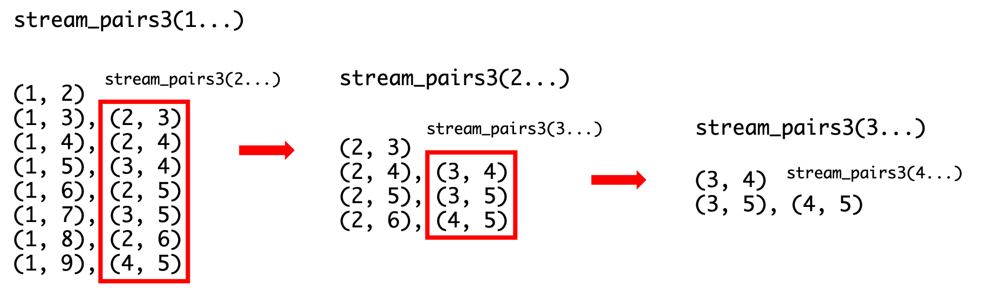

# Week 11 Studio

---

### Agenda

- Comments from Mission

- Reading assessment

- Streams - What the *heck* is going on?

- Studio

- Relook and reorganize teaching materials

---

### Comments from recent mission

- Don't ditch your recursion just yet! Recursion is a powerful concept and is still relevant now.

- It is a way of thinking and helps to solve certain problems in a much straightforward manner than using iteration loops
    - `d_merge`'s recursive solution is arguably more elegant than its iterative counterpart

---

## Reading Assessment 2

> It's okay to make mistakes, better now than during finals.

But if they're careless ones,  
kill urself.  
jk.

---

## Streams

> Hell no

----

### Streams

In order to generate an infinite list of `{1, 1, 1, ...}`, you are given the two
approaches as follows:
```javascript
// 1st approach
const ones = pair(1 , ones);
// 2nd approach
const ones = pair(1 , () => ones);
```
What happens here?

----

### Streams

- Main idea is **delayed evaluation** - you are delaying your evaluation till the time when you need it.

- Definition of streams - just like definition of lists
    - A stream of a certain type is either `null`, or a pair whose head is of that type and whose tail is a nullary function that returns a stream of that type. (from lecture notes)

- Stream discipline, just like list discipline

- Stream functions are not that different from list functions
    - Just add the nullary function at the tail of the list, and the `tail` calls are changed to `stream_tail` instead

----

### Streams

- How to think with streams?
    - Use abstraction, wishful thinking and HOF (higher order functions) thinking. Always try to look at the big picture and visualize what the stream should give you.

    - You can look at the specifics and details, but only use that to convince yourself that it works. Getting too sucked into the details might confuse you about what's happening, so take a step back, and observe what each stream represents on a higher level.

----

### Streams

A function that creates an infinite stream. Note the recursive call: why is a base case not needed?

```javascript
function integers_from(n) {
    return pair(n, () => integers_from(n + 1));
}
``` 

----

### Streams

More and more. Very fun stream!

```javascript
function more(a, b) {
    if (a > b) {
        return more(1, b + 1);
    } else {
        return pair(a, () => more(a + 1, b));
    }
}
``` 

----

### Streams

Fibonacci streams
```javascript
function fib_list(n) {
    function helper(a, b, count, result) {
        if (count === n) {
            return result;
        } else {
            return helper(b, a + b, count + 1, pair(a, result));
        }
    }
    return reverse(helper(0, 1));
}

function fib_stream(n) {
    function fibgen(a, b) {
        return pair(a, () => fibgen(b, a + b));
    }
    return eval_stream(fibgen(0, 1), n);
}
```

----

### Streams

More Fibonacci streams!
```javascript
const fibs =
    pair(0,
         () => pair(1,
                    () => add_streams(stream_tail(fibs), 
                                      fibs)));
```

Note:
- What is the idea here? You are generating the new stream one element by one element.

---

## Attendance

---

## Studio

---

### Question 2

What is happening here?
```javascript
function stream_pairs(s) {
    return is_null(s)
        ? null
        : stream_append(
            stream_map(
                sn => pair(head(s), sn),
                stream_tail(s)),
            stream_pairs(stream_tail(s)));
}
```

Note:
- What does stream_map do? takes an element from s and pairs it with the head of s.
- Wishful thinking for the recursive call to stream_pair. Finish the recursive call till the end first
- Is there this element? pair(5, null) as the last element? Why or why not? Trace

----

### Question 2 - Interleaving Streams

```javascript
function interleave_stream_append(s1, s2) {
    return is_null(s1)
        ? s2
        : pair(head(s1), 
               () => interleave_stream_append(s2, stream_tail(s1)));
}

function stream_pairs3(s) {
    return (is_null(s) || is_null(stream_tail(s)))
        ? null
        : pair(pair(head(s), head(stream_tail(s))),
            () => interleave_stream_append(
                    stream_map(x => pair(head(s), x),
                               stream_tail(stream_tail(s))),
                    stream_pairs3(stream_tail(s))));
}
```

Note:
- Look at how stream_pairs3 is defined
- stream_pairs 1 2 and 3, are they actually that different? They look different but they are essentially the same. The minor tweakings in the code are just to account for the differences in the execution of the functions and the program. I can easily change one form into another as long as you use the right functions. Remember, stay on the outside if you are not confident enough to dive deep into the details. Look at the big picture and think of what each function should return you and how you can use this return result.
- Look at the results of stream_pairs3, how does the interleaving work?

----

### Question 2 - Interleaving Streams

How does interleaving work? Look at the results:


Note:
- Must stay on the outside. Look at the big picture and don't get too sucked into the details.
- Go back, look at this a little more and try to absorb what's happening here.

---

### Question 3

[Sample solutions](https://sourceacademy.nus.edu.sg/playground#chap=3&exec=1000&ext=NONE&prgrm=GYVwdgxgLglg9mABAQwCaoPoGcoCcCmyAtlgBRYCMANIlgEwCUiA3gLCIeIFQi5IxYMYEABsR5Cg3acZAflp1pMjgC5EAoaPH0pyvYnmUl%2B1YgAOyGLlIALQqglMA1IjtpyjKsZP7STALwAfCjo2HiEJOThxBhQltqSXj7JKfo4BDFxMNqMDAwA3KwAvqysoJCwCLQQyCL4YRlEpBA06RFMbDLcvEhtMUTIZqQAHohBiBCIAFSIw63RRAXFpRAIOCGYWPi4MPhYYxsNEViFq2DrWDV12Nu7%2B-7VtfV9RIVl4NDwSGD4AObIUGetz25A6xm6fEe1y2OxBAFpqLQliV3hUvrQQAAjPDIaA3WFkSitRgscH4HiQtCbYGExE-f6A-F3Dx5Qoo8qfKqrfDAYCCKBwJkgkQCKAYODADDc3lYMEyM7rABe2zg93MlmsAAYaH4xsFlbhVUsZBzKvxAdYRTg5foIfxBMIxKQrVBdCl5AbVd59GoLFZbPZnaKGDqAsEYBbSFlxC68sbOCUuuSeupIy7xZLpXzkSs1lBEGAEEI-hgYGBAb9tmqyxWqxhgIampqlqjOUhyrFBTDmeUbRw7bQFhgBkNyjRC2Bi79S%2BW-lWc6UAPSLlAiMUIPa0GxwUSoRCY-BqADaiIRNFPiIAdNeALqsBX52rrn5qv3WRG68Zv0hnxCf4JPuKL6sqwy4THmq7PpuDzfh%2BYYFn8AJAgSpCARuspLGBD6QUB0GIB2ApCmQozjKMACkiB0GM-gPJqBiIBQiBqAiLaoAIZgiMgACepAAERoS%2BvFLGxWAcdxpD4AAbrURzEKha64Vg57Ni2oErp6%2BxYNuu77oeiBHtqiCGcZNCGdel53lhEEaQc36Gf%2BiAaUs2E2Q8VKyZEAl7PMjSxPE8lQRhbz3hB6G2RqpBwXqiDoc5EFmKqM61rgr4RVF4zuS8ZDoTQCWCDWc4pSBS4rpQW47iIe4HseiK1eeNDmXe2FlQ86GFCJYk8bxlBCe17GcTxUkyS8EjKcVakKOVOnVfpiJ0DQADMNAACwNbeIXnPm9C2YlBWVilfWiQNfH0L1rAdcdQ0iB5HhjUsQA)

---

### Question 4

- Look at how the problem is defined. Can you spot a recursive pattern?

- How can you make use of this pattern and the given prompt to produce the answer that you want?

----

### Question 4

[Multiplying streams](https://sourceacademy.nus.edu.sg/playground#chap=3&exec=1000&ext=NONE&prgrm=GYVwdgxgLglg9mABAQwCaoPoGcoCcCmyAtlgBRYCMANIlgEwCUiA3gLCIeIFQi5IxYMYEABsR5Cg3acZAflp1pMjgC5EAoaPH0pyvYnmUl%2B1YgAOyGLlIALQqglMA1IjtpyjKsZP7STALwAfCjo2HiEJOThxBhQltqSXj7JKfo4BDFxMNqMDAwA3KwAvqysoJCwCLQQyCL4YRlEpBA06RFMbDLcvEhtMUTIZqQAHohBiBCIAFSIw63RRAXFpRAIOCGYWPi4MPhYYxsNEViFq2DrWDV12Nu7%2B-7VtfV9RIVl4NDwSGD4AObIUGetz25A6xm6fEe1y2OxBAFpqLQliV3hUvrQQAAjPDIaA3WFkSitRgscH4HiQtCbYGExE-f6A-F3Dx5Qoo8qfKqrfDAYCCKBwJkgkQCKAYODADDc3lYMEyM7rABe2zg93MlmsAAYaH4xsFlbhVUsZBzKvxAdYRTg5foIfxBMIxKQrVBdCl5AbVd59GoLFZbPZnaKGDqAsEYBbSFlxC68sbOCUuuSeupIy7xZLpXzkSs1lBEGAEEI-hgYGBAb9tmqyxWqxhgIampqlqjOUhyrFBTDmeUbRw7bQFhgBkNyjRC2Bi79S%2BW-lWc6UAPSLlAiMUIPa0GxwUSoRCY-BqADaiIRNFPiIAdNeALqsBX52rrn5qv3WRG68Zv0hnxCf4JPuKL6sqwy4THmq7PpuDzfh%2BYYFn8AJAgSpCARuspLGBD6QUB0GIB2ApCmQozjKMACkiB0GM-gPJqBiIBQiBqAiLaoAIZgiMgACepAAERoS%2BvFLGxWAcdxpD4AAbrURzEKha64Vg57Ni2oErp6%2BxYNuu77oeiBHtqiCGcZNCGdel53lhEEaQc36Gf%2BiAaUs2E2Q8VKyZEAl7PMjSxPE8lQRhbz3hB6G2RqpBwXqiDoc5EFmKqM61rgr4RVF4zuS8ZDoTQCWCDWc4pSBS4rpQW47iIe4HseiK1eeNDmXe2FlQ86GFCJYk8bxlBCe17GcTxUkyS8EjKcVakKOVOnVfpiJ0DQADMNAACwNbeIXnPm9C2YlBWVilfWiQNfH0L1rAdcdQ0iB5HhjS2prokQohEaNCh9lwyaQt%2BbgOJQTAzD9LJJL48GZTSpDenolxPDdgM6D5ER%2BdkjghpDqR6E913diCRKDr50YsnGbKlFdN2Yy99DEiGDHNoUQA)

```javascript
function mul_series(s1, s2) {
    return pair(head(s1) * head(s2),
        () => add_series(
            scale_stream(head(s2), stream_tail(s1)), 
            mul_series(s1, stream_tail(s2))));
}

```
- Look at the definition of how you can multiply two large numbers provided in the studio sheet. Does it look recursive?

- Same thing as before, stay on the outside, look at the big picture and don't get too sucked into the details if you are not confident.
