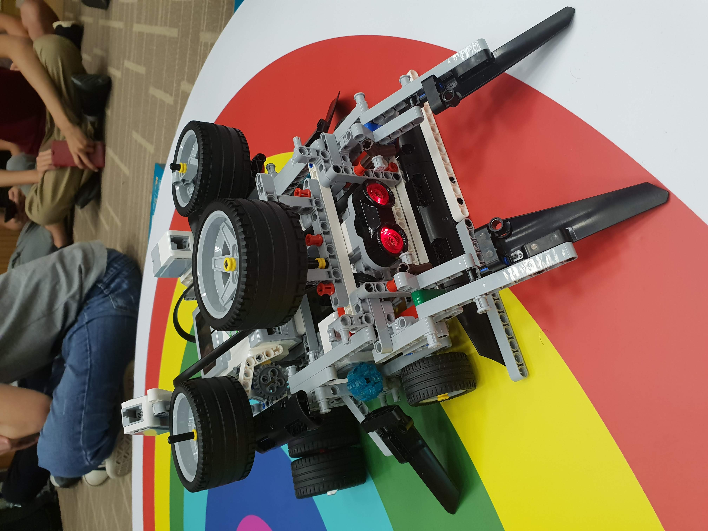

# Welcome to CS1101S

---

### About Me

- Chen Yuan Bo
- Year 2, Computer Science
- Love dancing

Note:
- tele group to facillitate communication
- studio allocation not set, hold until next week

---

### About You

- Name, School, Hobbies
- Why did you choose Computer Science?

Note: Ask about background

----

### Game

- Take a stack of paper each.
- Think of **3 words**, that can be put together in a drawing (i.e. rubbery swimming cat).
- Pass paper to **right**, 30 seconds to guess and **draw the 3 words**
- Pass paper to **right**, 7 seconds to guess the drawing and **write down 3 words**
- Should end up with your own paper at the end.

---

### About Computer Science

- Hard 
    - Rigorous (aka no smoking your way through) 
    -  Heavy workload (always things to learn) 
- Rewarding and fun 

---


<div style="position: absolute; max-width: 40%; right: 0; top: 30%;">
    <h3>Sumobot</h3>
    <!-- <a href="https://photos.app.goo.gl/xEh4xEGSEXR9hWTg6" style="font-size: 25px;">Watch Video</a> -->
</div>

---

<section data-background-iframe="https://ybchen97.github.io/orbiboy/" data-background-interactive>
</section>

---

### Other opportunities
- [Hack & Roll](https://hacknroll.nushackers.org/)
- [CVWO](https://www.comp.nus.edu.sg/~vwo/) (Computing for Voluntary Welfare Organizations)
- [NUS Hackers Notes to CS Freshmen](https://github.com/nushackers/notes-to-cs-freshmen-from-the-future).

---

### Goals of this module
- Primer to programming and computational thinking
    - How to think 
    - How to solve problems 
- This module is not a javascript 101 course 
- Learn how to learn, and learn how to think 

---

### What you can expect from CS1101S

- Hard 
    - Rigorous 
    - Relatively heavy workload 
- Rewarding and fun 
    - If you embrace the challenge 

---

### What I expect of you

- Understand! Do not memorize!
- Do your tutorials!
- ASK QUESTIONS!
- Be **consistent** in your work.

---

### What to expect of me

- I will:
    - Monitor your progress and give comments on your code
    - Clarify your doubts
    - Give you challenge questions to try

- I will not: 
    - Re-teach the materials taught in the lecture
    - Debug your code

---

### Comments from first Mission

- Pretty good, though some misunderstood the first question.

- Read up on the [runes library](https://sicp.comp.nus.edu.sg/source/RUNES/index.html) to see what functions you have before bulldozing through the missions.

----

### Useful materials

- [SICP textboook](https://sicp.comp.nus.edu.sg/)
- [Source documentation](https://sicp.comp.nus.edu.sg/source/)
- [Piazza](https://piazza.com/class/juazn2axpf35wp) (student forum)
- Source style guide
- [Source academy editor keyboard shortcuts](https://github.com/ajaxorg/ace/wiki/Default-Keyboard-Shortcuts)

Note:
- There will be quite a few things never seen before, but don't fret
- Search for relevant ones, the rest will be taught throughout the course of the semester

---

### Attendance

1. Open telegram, search for @CS1101Sbot
2. Start the bot, and type in
```
/setup <Your matric number>
```
3. Once you have successfully registered, type 
```
/attend <token>
```
4. Receive reply that you have successfully marked your attendance.

---

### Week 2 Studio

> Each person take 1 question, write down your solutions on the board.

Note:
- Q4 for usage of abstraction
- Q8 for reading of source documentation, and also solve it without the floor function