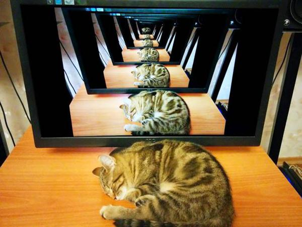

# Week 3 Studio

---

### About Me

- Chen Yuan Bo
- Year 2, Computer Science
- Love dancing
- Telegram: @yuan_bobo

Note:
- tele group to facillitate communication

---

### About You

- Name, School, Hobbies
- Why did you choose Computer Science?

Note: Ask about background

---

### How to do well in CS1101S

- Do your tutorials. All of them.
- Understand. Don't memorize.
- Practice, practice, practice. (Missions, quests etc)
- Ask questions

---

### Agenda

- Recursion
- Order of Growth
- Studio

---

# Recursion

Note:

- Applicative order not terminating but normal order does ([link](https://sicp.comp.nus.edu.sg/chapters/8#ex_1.5)).
- Applicative order: evaluate the arguments then apply
- Normal order: fully expand then reduce
- [Textbook explanation](https://sicp.comp.nus.edu.sg/chapters/12#h1)

----

### What is Recursion?

- Method of solving problems where solutions depends on solutions to smaller instances of the same problem

----

### What is Recursion?


----

### What is Recursion?


----

### What is Recursion?



Note: google recursion

---

### Using Recursion to solve problems

- Break the problem into smaller sub-problems
    - Use wishful thinking!
- Base case
    - Smallest sub-problem possible, where the function call just evaluates to a result directly

---

### Recursive Function

Any function that calls itself is a recursive function.

----

### Example recursive function

```javascript
function factorial(n) {
    return n === 1 
        ? 1 
        : n * factorial(n - 1);
}
```
---

### Tower of Hanoi

> Tower of Hanoi consists of three pegs or towers with n disks placed one over the other.  
The objective of the puzzle is to move the stack to another peg following these simple rules.  
1. Only one disk can be moved at a time.
2. No disk can be placed on top of the smaller disk.

Note:
- Solve it together with me
- What is the smaller sub-problem? Use wishful thinking!
- What is the base case?

----

### Tower of Hanoi

```javascript
function hanoi(num, current, target, other) {
    if (num === 1) {
        display("move " + current + " to " + target);
    } else {
        hanoi(num - 1, current, other, target);
        display("move " + current + " to " + target);
        hanoi(num - 1, other, target, current);
    }
}

hanoi(3, "1", "2", "3");
```

Note:
https://www.mathsisfun.com/games/towerofhanoi.html
[link](https://sourceacademy.nus.edu.sg/playground#chap=1&ext=NONE&prgrm=GYVwdgxgLglg9mABACwIZjjAFGEBbAGkQhACdSBTMKIqVUgcwpsTimQtIEpEBvAKERDEMYIhz5EAXhmIAjDwHDliACYwAzgAcANqgCeWAER44ANwqIjiANTEylarauIocF3bqNmXANyDhAF9ECh0NSyUVITQMbFw8RABaeSIScioWNg5SWnomKD8AqPVtPUMTc0trOzTHKGdrNw9XPJ9-KOj0TAkE5LkiLM5c7xZajMLlQP4p-hjugGYiIzkjJYAmVat5oz8gA)

---

### Recursive process vs Iterative process

- Deferred operations 
- Why? 

---

### Recursive process vs Iterative process

```javascript
function factorial(n) {
    return n === 1 
        ? 1 
        : n * factorial(n - 1);
}

function fact_iter(n) {
    return iter(1, 1, n);
}

function iter(counter, product, max_count) {
    return counter > max_count
        ? product
        : iter(counter + 1, counter * product, max_count);
}
```
Note:
- Can shorten the iter function by going from start
- Segue to why deferred operations take space - function stack call
- [link to textbook showing deferred operations](https://sicp.comp.nus.edu.sg/chapters/13#p1)
- stack and stack overflow

# Order of Growth

---

<section data-background-iframe="https://www.desmos.com/calculator" data-background-interactive>
</section>

Note:
- explain the N0 (n nought), the k

---

### What is Order of Growth?

- **Purpose**: Find a rough measure of the resources (time
and/or space) used by a computational process (a program).
- **Approach**: Use a mathematical function to describe how the amount
of resources consumed grows along with the scale of the problem.

Note:
- We do not need a precise (but complex) expression of
that function. Instead, we want a simple (but useful) expression to
describe its limiting behavior.
- In other words, we want to find an approximation of that function.

----

### Types of Complexity (for CS1101S)

- Time: how long does the program run
    - Number of steps/function calls  
- Space: how much memory do we need to run the program
    - Number of deferred operations  

Note:
- space complexity would be more relevant when they start learning data structures such as lists and trees
- time/space grow proportional to the size of the program

----

### Types of Order of Growth

| Order (Time) | Description | Example |
|--|--|--|
| $\mathcal{O}(1)$ | Constant | Add, subtract, multiply, square... |
| $\mathcal{O}(\log{n})$ | Logarithmic | Binary search |
| $\mathcal{O}(n)$ | Linear | Factorial |
| $\mathcal{O}(n\log{n})$ | Nifty | Merge Sort |
| $\mathcal{O}(n^2)$ | Quadratic | Bubble Sort, Selection Sort |
| $\mathcal{O}(2^n)$ | Exponential | Fibonacci |

----

### Example 1

```javascript
function foo(n) {
    return n < 0
        ? 0
        : foo(n - 1);
}
```
- Time complexity: $\mathcal{O}(n)$  
- Space complexity: $\mathcal{O}(1)$ 

----

### Example 2

```javascript
function foo(n) {
    return n < 0
        ? 0
        : foo(n - 1) + 2;
}
```
- Time complexity: $\mathcal{O}(n)$  
- Space complexity: $\mathcal{O}(n)$ 

----

### Example 3

```javascript
function foo(n) {
    return n < 1
        ? 0
        : foo(n / 2);
}
```
- Time complexity: $\mathcal{O}(\log{n})$  
- Space complexity: $\mathcal{O}(1)$ 

----

### Example 4

```javascript
function foo(n) {
    return n < 1
        ? 0
        : foo(n / 3) + 3;
}
```
- Time complexity: $\mathcal{O}(\log{n})$  
- Space complexity: $\mathcal{O}(\log{n})$ 

Note:
- Why does base not matter?
$$ \frac{x}{y} $$
$$ \log_a{x} = \frac{\log_b{x}}{\log_b{a}} $$
- Why is the space complexity logn?

----

### Example 5

```javascript
function foo(n) {
    const k = n / 3;

    function iter(n) {
        return n < 0 
            ? 0 
            : iter(n - k);
    }

    return iter(n);
}
```
- Time complexity: $\mathcal{O}(1)$  
- Space complexity: $\mathcal{O}(1)$ 

----

### Example 6

```javascript
function foo(n) {
    return n < 0
        ? 0
        : foo(n - 1) + foo(n - 1);
}
```
- Time complexity: $\mathcal{O}(2^n)$  
- Space complexity: $\mathcal{O}(n)$ 

Note:
- Why is space complexity O(n)? (VERY IMPORTANT!)

----

### Example 7

```javascript
function foo(n) {
    return n < 1
        ? 0
        : foo(n / 2) + foo(n / 2);
}
```
- Time complexity: $\mathcal{O}(n)$  
- Space complexity: $\mathcal{O}(\log{n})$ 

Note:
- How many function calls are there? Draw on board (2n)
- How many deferred operations?

----

### Example 8

```javascript
function foo(n) {
    const k = math_sqrt(n);
    function iter(n) {
        return n < 0 
            ? 0 
            : iter(n - k);
    }
    return iter(n);
}
```
- Time complexity: $\mathcal{O}(\sqrt{n})$  
- Space complexity: $\mathcal{O}(1)$ 

----

### Attendance Taking

1. Open telegram, search for @CS1101SBot
2. Start the bot, and type in
```
/setup <Your matric number>
```
3. Once you have successfully registered, type 
```
/attend <token>
```
4. Receive reply that you have successfully marked your attendance.

---

# Studio Sheet

Note:
- fast_power: dividing is good as it reduces size by half, so slowest will be divide, minus, divide, minus...and that is possible for 2^n-1
