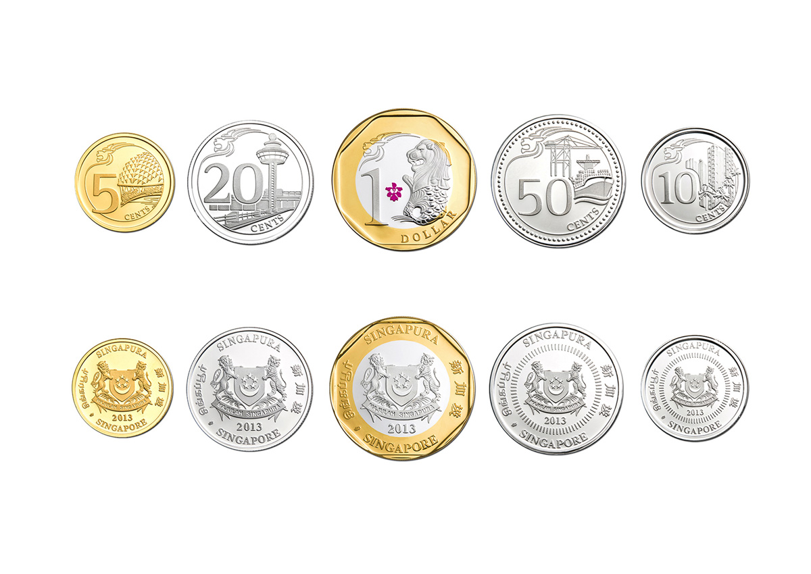

# Week 4 Studio

---

## Studio 3 Quesition 2

> Ben Bitdiddle's claim actually depends on the base of the logarithm!

Note:
- Show desmos.com for graphing calculator

---

### This Week's Agenda

- Coin Change
- Higher Order Functions
- Studio

---

### Coin Change

> How many ways can I change x amount of money given n kinds of coins?  
> - Amount: 1.50  
> - Coins: unlimited amount of 100, 50, 20, 10, and 5 cent coins

----

### Coin Change

- Base case:
    - 0 amount of money left &mdash; 1 <!-- .element: class="fragment" -->
    - 0 kinds of coins &mdash; 0 <!-- .element: class="fragment" -->
    - < 0 amount of money left &mdash; 0 <!-- .element: class="fragment" -->
- Smaller problem:
    - Number of ways to change money **using first kind of coin** <!-- .element: class="fragment" -->
    - Number of ways to change money **without using first kind of coin** <!-- .element: class="fragment" -->



Note:
- Why are all grounds covered when I say using first kind of coin and not using first kind of coin?

----

### [Coin Change](https://sourceacademy.nus.edu.sg/playground#chap=1&ext=NONE&prgrm=GYVwdgxgLglg9mABBO4oH0IAsCGYDmApgBQ4C2qYUAlIgN4BQiziAToVCK0hBKRWgA0iAKzUA3AwC%2BDUJFgJkfcpSjCA1jDAATAM7o4wTHC27ajFmw5ckKtIgC8TxAAYmlj4gD8iAIzvPFgAuRDsqRAAeV0QAHxiAwJZNHX1DY1NHZzdEjx9snOClflUNLT0DIxQMgFo-agSCxABqBoLeYvta4BhWXQxtQjA4Mi0cBTBiVsbp5mTytKqwM0EpxrnUypMliWlZcGh4JG7e-sHh0fHidYr07foE9k5uRGuFrd1Mhz9vUUQg1aSZQ2tw%2BTi%2BACYfr4XH8AbMgTdFqDnABmH7gmH-NYIt4ZMGIAAsPxEmLhLxxmzxzhEUJcmNckhkDBQaEwuAIJF8JIkQA)

```javascript
function count_change(amount) {
    return cc(amount, 5);
}
function cc(amount, kinds_of_coins) {
    return amount === 0
           ? 1
           : amount < 0 ||
             kinds_of_coins === 0
             ? 0
             : cc(amount, kinds_of_coins - 1)
               +
               cc(amount - first_denomination(
                               kinds_of_coins),
                  kinds_of_coins);
}
```

----

### Coin Change

```javascript
function first_denomination(kinds_of_coins) {
    return kinds_of_coins === 1 ? 5 :
           kinds_of_coins === 2 ? 10 :
           kinds_of_coins === 3 ? 20 :
           kinds_of_coins === 4 ? 50 :
           kinds_of_coins === 5 ? 100 : 0;
}
```

---

### Before Higher Order Functions

- Variable scoping
- Function definition expressions

---

### Variable Scoping

- **Pre-declared** functions or constants are visible anywhere
- **User declared** functions or constants are only visible within the block that they are declared (i.e. the closest surrouding curly braces)
- **Function parameters** are visible only to the body of the functions that they belong
> **Scoping rule:** name occurrence refers to the closest surrounding declaration

----

### Variable Scoping

```javascript
const x = 5;

function f(x) {
    return x;
}

f(3);
```

What is the result of this program?  

Ans: 3 <!-- .element: class="fragment" -->

----

### Variable Scoping

```javascript
const x = 5;

function f(y) {
    const x = 10;
    function g(y) {
        return x;
    }
    return g(x);
}

f(x);
```

What is the result of this program?  

Ans: 5 <!-- .element: class="fragment" -->

---

### Function Definition Expressions

An expression that defines a function, but does not assign a name to the function (other name: arrow functions)
```javascript
x => x + 1;
```

Question: Can you still assign a name to the arrow function? <!-- .element: class="fragment" -->

----

### Function Definition Expressions

Yes, these functions can still be assigned a name
```javascript
const addone = x => x + 1;
addone(1); // returns 2
```

- Why? <!-- .element: class="fragment" -->
    - More concise way of defining functions
    - Often used for short, one-lined functions where names are not needed
    - Higher order functions

---

### Higher Order Functions

- What?
    - Functions can be passed into other functions as arguments
    - Functions can be returned by other functions as return values


----

### Higher Order Functions

```javascript
/*
Consider a restricted form of Source in which functions are 
allowed to have at most one parameter. Rewrite the following 
function definition under this restriction:
*/

function myfunc(a, b, c) {
    return a * b + c;
}

/*
With this new function definition, how do you rewrite the
function call myfunc(3, 2, 1)?
*/
```

----

### Higher Order Functions

```javascript
function myfunc(a) {
    return b => c => a * b + c;
}

((myfunc(3))(2))(1);
```

----

### [Higher Order Functions](https://sourceacademy.nus.edu.sg/playground#chap=1&ext=NONE&prgrm=GYVwdgxgLglg9mABABwDYgM4H0EFMAUAHgJSIDeAsItYgE65Qi1KGIDUiAjANwUC%2BFUJFgJEUWgEMwGfEIilKNOgyYtEAXgB8iAEyIAVIjlEDu4rwFyRSKAHcYEAnIVUa9Rs0SstR8BFl%2BRMTm-BQU%2BPh2DgTiUjJomDhguMHB%2BJwhEVGOkZLSaQnYeGkZ3EA)

```javascript
function plus_one(x) {
    return x + 1;
}
function trans(func) {
    return x => 2 * func(x * 2);
}
function twice(func) {
    return x => func(func(x));
}

// Evaluate the following
((twice(trans(plus_one))))(1);
((twice(trans))(plus_one))(1);
```

`(twice(trans(plus_one)))(1): 26` <!-- .element: class="fragment" -->

`((twice(trans))(plus_one))(1): 20` <!-- .element: class="fragment" -->

----

### Higher Order Functions

- Why?
    - Might not see the use now, but later when **map**, **accumulate** and **filter** comes it, they'll be really handy.
    - **Map**, **accumulate**, **filter** are really useful functions for data manipulation within data structures.

---

## Studio Sheet

----

### Thrice Thrice Thrice

```javascript
function compose(f, g) {
    return x => f(g(x));
}

function thrice(f) {
    return compose(compose(f, f), f);
}

const square = x => x * x;
const add1 = x => x + 1;
```

----

### [Thrice Thrice Thrice](https://sourceacademy.nus.edu.sg/playground#chap=1&ext=NONE&prgrm=GYVwdgxgLglg9mABBOBbADnAzgUwBTAA0iA5gJSIDeAUInYgE45QgNIAeiAvAHyLB4SedmTIBuagF9q1UJFgJEUABYMYEfMAo16jZqyQoM2fEcy4CxLVfFSZc6PCQBDACauE%2BEVVr0mLNkROAGpEAEYJaVlwR0UsAEcQZyZhbV86fwMgxAAqIMj0xGoAemLEPBU1DQrVdRxRPDcPMHq8ADZbUqVa6sq6skb3TwGAVgouCfK%2B3p78afwm4dFR2yA)

1. `thrice(thrice)(f)` $\equiv$ `thrice(thrice(thrice(f)))`  

2. `thrice(thrice)(f)` $\equiv$ `thrice(thrice(x => f`$^3$`(x)))`  

3. `thrice(thrice)(f)` $\equiv$ `thrice(x => f`$^9$`(x))`  

4. `thrice(thrice)(f)` $\equiv$ `x => f`$^{27}$`(x)`

---

## Attendance

