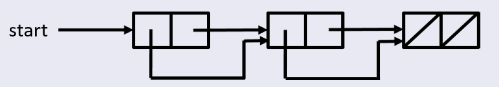
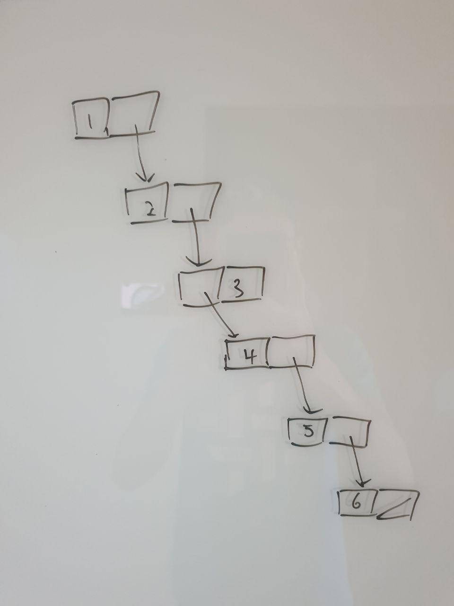
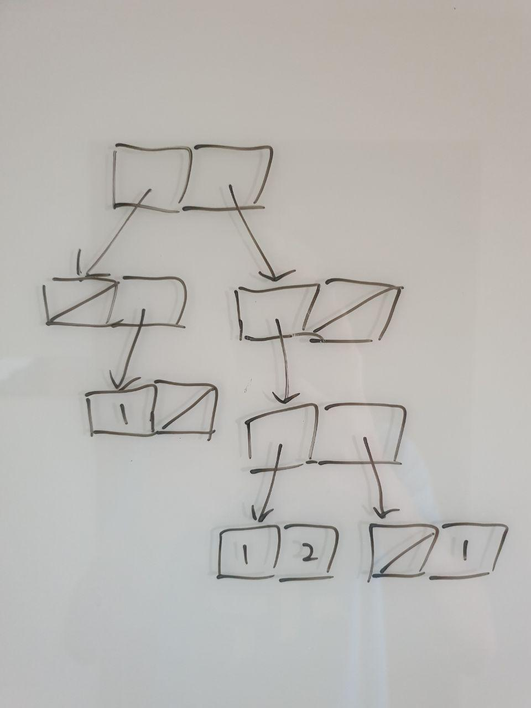

# Week 5 Studio

---

### Agenda

- Reading Assessment
- Updates
- Data Structures - Lists & Pairs
- Identity vs Equality
- Studio
- Extra Questions

---

### Reading Assessment

[Trick question!](https://sourceacademy.nus.edu.sg/playground#chap=1&ext=NONE&prgrm=GYVwdgxgLglg9mABAcwBQA8CUiDeAoRQxUSWBFDbfIm48aeJNLXA29gJwFMoQOkMiADwBeRAGZsAfgkAWRAC4K6RAFoJmANxt2AXx21uvfokGjEAJmmXxi5WstaD%2Bmkb4CV5gIzWvFu8wOPtr6aF4ADOFOeAD0AFR4EAgAzlCIKmJe2tRESWCp6YhiFto0Oex5BRkSpeysdbSVadWytQ2EACYwyQAOADYAhgCelG20LkT6%2BnExeLExiACSyYhQABbdq2tciMkDALY7AyvrRwBGcABuOx1cwDBgMGRIcMAoUvOITShFhSIAfKZPJlfP4lIF1MFPvgYgsaN9kL8MoCzMVrBZbODBOorNpYbQYXC6gikUUUcCNIgZOJ5FiVOpJHiiYR9PjWQswpFoviSWJkax8fCUmlEXyyQLmY1hT8xQCgcIxJIqXIAtiNEz2m4TKjHMqMar6Y4NTRdMaiFqPArED5lX4DUEnGyNZyoto8EA)

```javascript
function g(x) {
    function g(x) {
        function g(x) {
            return (x <= 3) ? 34 : g(x - 3);
        }
        return (x <= 2) ? 23 : g(x - 2);
    }
    return (x <= 1) ? 12 : g(x - 1);
}

g(100);
```
- Any other questions you want me to go through?

Note:
- Variables with the same name can be declared in separate scopes (i.e. blocks)
- Follow the lexical scoping rule - take the occurence in the closest surrounding block

---

### Updates

- [Source 2 documentation](https://sicp.comp.nus.edu.sg/source/source_2.pdf) (**Highly recommend reading**)
- No unsubmit option for missions anymore. **Check** before you submit!

---

### Data Structures

- Data structures can be seen as containers that store information.
- [Functions as data structures!](https://sourceacademy.nus.edu.sg/playground#chap=1&ext=NONE&prgrm=GYVwdgxgLglg9mABMGAnAzlA%2BgEwKZhwC2MYAhrAgBQDWpO6WcwWEcp6AlIgN4BQiQYlR4oIVEjpgGTFmw6IAvMsQBGRAH5EAVkQAuAUKNCpM5q3Zh0SlQCZNagAz7Dxo6cbn5Vm4sQBmB1tnAzdjD1kLBWU-ABYHbRDERwBuPgBfPj4UDGx8QhJySjAqf04UoA)
- Different data structures have different ways of interacting, processing and manipulating the data stored inside them.
- Definitions of data structures are important, because they **define precisely how you can interact with the data within them**.

---

### Lists

**Definition**: A list is either `null` or a pair whose tail is a list
> Definition of a list is recursive! 


```javascript
/*
list(1, 2, 3, 4) -> pair(1,
                        pair(2,
                            pair(3,
                                pair(4, null))))
*/
``` 


Note:
- Talk through the definition of a list using this as an example.
- Make sure they understand the structure of a list

---

### Box and Pointer Diagrams

- Head 
    - Always contains current item if the current item is **primitive**
    - Otherwise, contains a pointer to the current item
- Tail
    - Points to the next item in the sequence
    - Contains `null` if it is the last item of a list.
    - Note that `null` can also be considered as an item!

----

### Box and Pointer Diagrams

> Write out a program which gives this box and pointer diagram:
> 

Is this a list? 

---

### [Some Practice with Lists](https://sourceacademy.nus.edu.sg/playground#chap=2&ext=CURVES&prgrm=PTAEEkGdQFwCwJbQIagDZJgfgFA5KEgPoaQwAUADsggE7kB2ArmmgDSjOsCU3A3PjDFSFanSo16Y%2BgCIAZgHcApjI4y4S1gHsZ3DlzR7Q0ieICMHAExGTB-S0O9%2Bg0ABNayBUVfIYyU1KSAeTyyqqg6ppoOkYGNkEmFqDWHLYO9jxOfEA)

```javascript
// Is this a list?

pair(null, null);
pair(pair(pair("fwe", "hello"), null), 
     pair(pair(1, 2), pair(null, null)));
```

----

### Some Practice with Lists

Is this a list?


----

### Some Practice with Lists

Is this a list?


----

### [Some Practice with Lists](https://sourceacademy.nus.edu.sg/playground#chap=2&ext=NONE&prgrm=GYVwdgxgLglg9mABDAzgfQDaqgCgyqASkQG8AoRSxAJwFMoRqlU0wQMM8DiAfHxHCwAOAQxjUuRRADJpydFgI4oYzviKFCAbjIBfMmRaLcbDtqA)

- `is_pair()` checks if input is a pair
- Can we do the same for lists as well?
> Create a recursive function `is_list()` that returns `true` if its input is a list, and `false` otherwise.

Note:
- Time complexity: O(n)
- Space complexity: O(1)

----

### [Some Practice with Lists](https://sourceacademy.nus.edu.sg/playground#chap=2&ext=NONE&prgrm=GYVwdgxgLglg9mABAUwI4gIYBsAUAPAGkQE8BKRAbwChFbEAnZKEepHGAZwH0AHDGevnIAyYYk69%2BgsqRp15AfhTpsOABbIMAEyFEN2nDMSjlmXFH648pIhZi4Zc%2BbQBciPIgC83kgG4qAL5UVGhmOFicUDgAjEQATEQAzDaIERxRsYgJiMmk-qGqaRnxSSl8AjFE5YLZ1TiJRGAgWFikbXlAA)

How to check for equality of lists?
> Create a recursive function `equal()` that takes in two list inputs, x and y, and returns `true` if list x is equal to list y, and `false` otherwise

What kind of structure will result in the worst possible performance for this function?

Note:
- What's the worst case for the performance of this function? A structure similar to Binary Trees but is not
- Time complexity: O(n) if n refers to number of pairs in the structure
- Space complexity: O(log(n)) if n refers to number of pairs in the structure

---

### Equality vs Identity

- Equality and Identity are not the same
- **Identity** - Two things are actually the same object, just with different names.
- **Equality** - Two things hold the same value (or have the same struture), but are different objects.

----

### Equality vs Identity

- **Booleans**: straightforward
- **Strings**: straightforward
- **Numbers**: straightforward for small integers, but not the case for non-intergers and large numbers
- **Functions**: Two separately defined functions are always not identical, even if they have the exact same behaviour
- **Lists**: Two separately defined lists are always not identical, even if they have the same value and structure

----

### [Equality vs Identity](https://sourceacademy.nus.edu.sg/playground#chap=2&ext=CURVES&prgrm=PTAEGMHsDsGcBdQAcCMoC8yCGBLATgNwBQIEMCyATBtvsaahupkpcSWFHIoy7ngAoUAGlCUAlPU7ke1PviGiJU5GmYs2RDmW6gANmv04EKrhT1yjJ7QaaYL7UmcS37x%2BAMnbn%2By3veeKq7Mvo7Suq5WHl5OMr400ACuenpBaiEOREA)

```javascript
const p1 = pair;
const p2 = pair;
p1 === p2;

const p1 = pair(1, 2);
const p2 = pair(1, 2);
p1 === p2;

const l1 = list;
const l2 = list;
l1 === l2;

const l1 = list();
const l2 = list();
l1 === l2;

const l1 = list();
const l2 = null;
l1 === l2;
```
----

### [Equality vs Identity](https://sourceacademy.nus.edu.sg/playground#chap=2&ext=NONE&prgrm=PTAEHEEsDcFMDtQBcAWtQDMD2AbHWB3SeAc1ABNYNjIlIt4BnALgCgBjBxpUAJwEN45LAFsAjKAC8oABQBKKQD5Q8AK54A3By48BQ0QCYpshZOVrN2prsHCRAZmMWcWztb63RAFifqXV7lB%2BYz07MVcdUAAjEM9xLVYQUAB1FABPCixkNEZ0JAIsnGJYRlASGHRySAwMWF4EXRL1JEYAflZQ0QlJHo99EQMNUCSMfhxcjrjHHulOkS8hpKReVVhWRLBU-h5hEuzIUthoMdVtvKx2ubF5KV65%2By1gmeiNIA)

```javascript
// Given the following definitions:
const random1 = () => null;
const random2 = () => null;
const random3 = null;
const random4 = null;
const a = random1;
const b = random1;

// Why do these two lines give different results?
random1 === random2; // false
random3 === random4; // true

// What does this evaluate to?
random1() === random3;
a === b;
```

Note:
- random1 line creates a new function object, but random3 line assigns the value of `null` to random3;

---

## Attendance

---

## Studio 5

----

### Reversing a list

```javascript
function reverse(list) {
    function reverse(lst, newlst) {
        return is_null(lst)
            ? newlst
            : reverse(tail(lst), pair(head(lst), newlst));
    }
    return reverse(list, null);
}
```

Note:
- Time complexity: O(n)
- Space complexity: O(1)


----

### [Studio Q3](https://sourceacademy.nus.edu.sg/playground#chap=1&exec=1000&ext=NONE&prgrm=MYewdgzgLgBANtAjDAvPAltAFAdgDQbYBsBArAQCwCUBAzAXJlFgEwGJVUDcAUAPR8YACwCmAQwAmWKGPRwsoydNnyZc5evjQYnXVR49QkWAigtUhZo2w4alrCRjkY1Bkyz0YLOx14Dh4lJqqioa8lqwegZG2qa0FtbM%2BPZEdolYzunUae6e6Wz2HLp%2BgopSZWEKgZUVwZV1ETp6UYbgsdAUCe7J6emOpDnYrjCe3m7Y6UXc-KXVFbWhDaZNukA)

----

### [Studio Q5](https://sourceacademy.nus.edu.sg/playground#chap=2&exec=1000&ext=NONE&prgrm=PTAEEUFcFMGcBcCWB7AdgLlAFQBaNqAG7QBOsKqoyAZqLJALaj6irLyjSpInQA2AT1ABDAMajIJYfGgA6UAHUcAgPwAoapFSikaOo1gAKAB6wAlKADea0LdCbtuyjn4AHUoYGwANJ2KpfZAATIItrOwjQXnhJSnwAfVRIPj5PcxtIzJVQPnx4Q2Cg32h-MwzMiMwXPncSQ3hhRFSvM0CQ0ABqUBdhILTWvy4zAG5y0ABfMejY7rcPU18ABiWRtUmNLR0KfQZYACYTcysxhy29atq03wSSrmL-NtDjiqjoGJI42ETk5vSXiOyuQQhluASoITK-zsmBu-jGUNs2QuHgaTX6vmowj4sGg9y4nVmvXR4NC8IRVTmdVRvwG8BIMDxYMKBJ6fRaqwikwi0w%2Bsxq8x8oDpDNAy1Fq3WpycgxIAniONEaD62PgYSmbxmhgSSRShhVZgsAB9DaAtV8dalqXqEAbIRVshaybZMK5GnVWfVGql9QNbrL5dBFag%2BlarT6DaN1vRdnq8oYAIzePbeADM3gALN4AKwRtQgHb7WPAxPJtPp3P5v1yhVKov5EupjMRoA)

Click on the link and look at the first sum function defined. Is the implementation correct? Why or why not?

---

### Extra Questions

Given two lists of the same length `xs` and `ys`, try to construct a 3rd list of the same length in which each element is a pair composed of the elements in the same position from `xs` and `ys`. Your function name should be called `make_pairs`.

```javascript
// For example, the following returns:
// list(pair(1, 11), pair(2, 12), pair(3, 13)).

make_pairs(list(1, 2, 3), list(11, 12, 13));
```

----

### Extra Questions

Now, generalize this concept by defining a new function. Given two lists of the same length xs and ys, try to construct a 3rd list of the same length in which each element is the result of applying a certain zip function to the two elements on the same position from xs and ys. Your function name should be zip.

```javascript
// For example, the following will return list(11, 24, 39)

zip((x, y) => x * y,
    list (1, 2, 3),
    list (11, 12, 13));
```

[Solution](https://sourceacademy.nus.edu.sg/playground#chap=2&exec=1000&ext=NONE&prgrm=GYVwdgxgLglg9mABBOBbARjMBTAFADwGcAaRAT0IEpEBvAKEUcQCdsoRmkZCB9MEADYCCVBk3EB%2BcoTHjGALkTc%2Bg4RUqy5kxEU1aFiAA4BDGM1wmzuABbZjAExGVSth7nXPkaTDlxRTwkSe-jBqVJSUANx0AL50dPbMxgDuPPbG-rgoGFh4AtxQuACMpABMpADMpAAspACsnvmEhSWI5YgVEVHxoJCwCIgAXjCGuMCkRKTqtJqs7JxKvPxCTnpMUhRrBsrLYRr6clK6B%2BKKlubANnaOQS7X7uGkw6PjiCGBVKTvD13RcQlJVLpTLPCymZikJotMqVeqNArFGEdOERaJAA)