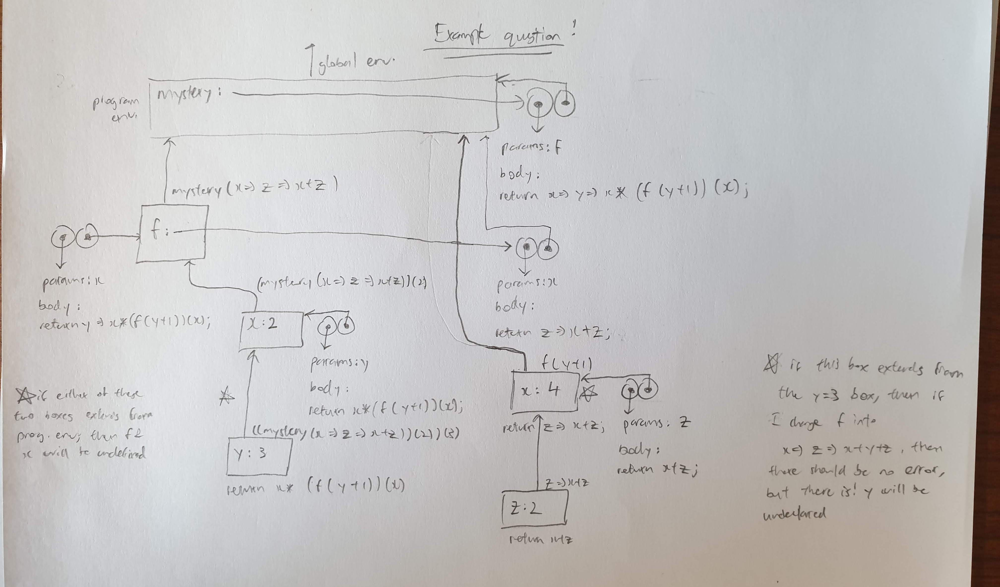
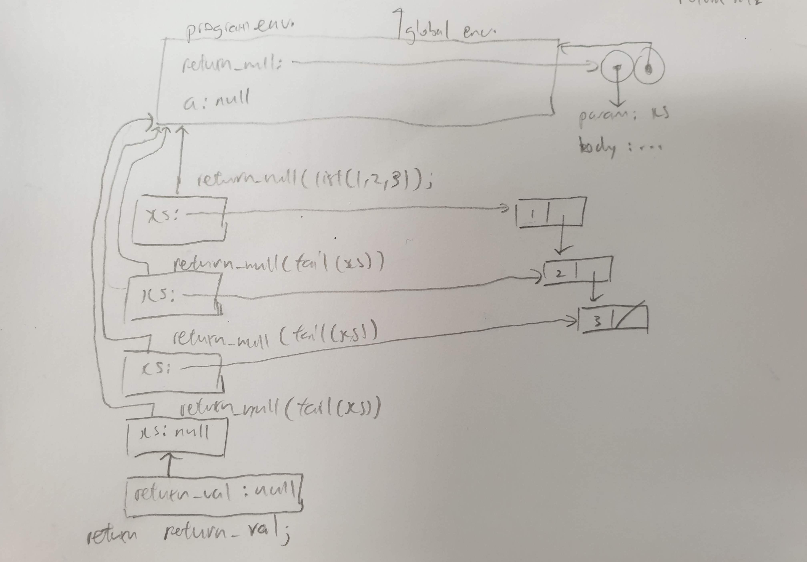
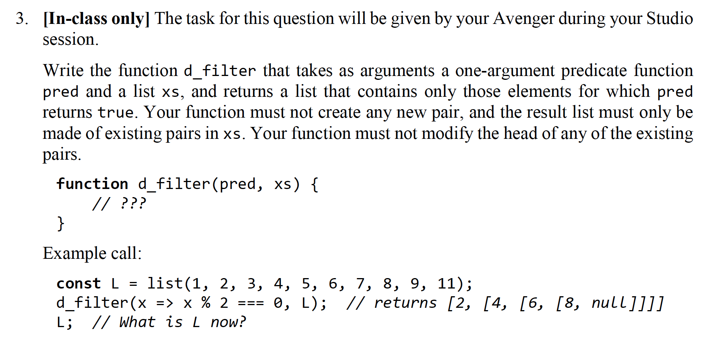
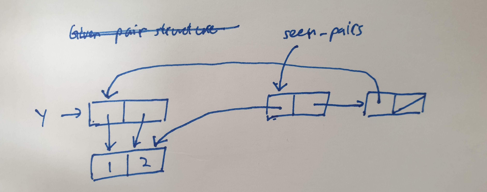
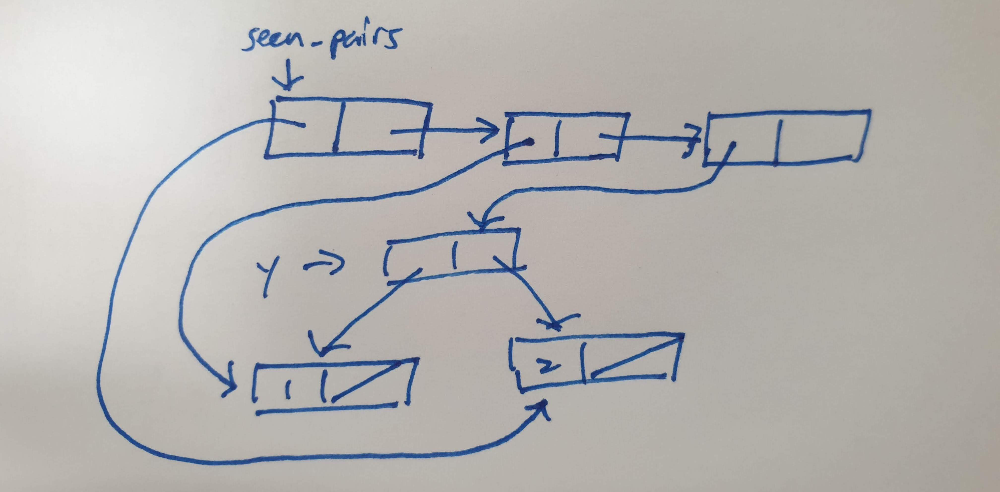

# Week 9 Studio

---

### Agenda

- Mutable variables
- Environment model
- Studio Questions

---

### Variables: Immutable vs Mutable

> Think of variables as containers that holds a value inside. This value can be anything.

```javascript
const a = 1;
const b = "a string";
const c = true;
const d = pair(1, null);
const e = [1, 2, 3];
```

----

### Variables: Immutable vs Mutable

> However, immutable variables such as `const` can only hold one value. This variable cannot be reassgined to another value.

```javascript
const a = 1;
a = true; // error
```

----

### Variables: Immutable vs Mutable

> Mutable variables such as `let` on the other hand, can be reassigned to another value.

```javascript
let a = 1;
a = 2; // ok
a = true; //ok
a = [1, 2, 3]; //ok
a = pair(1, null); //ok
a; // pair(1, null)
```
[Function parameters are now mutable variables as well](https://sourceacademy.nus.edu.sg/playground#chap=3&exec=1000&ext=NONE&prgrm=GYVwdgxgLglg9mABACwBQA8DOBKRBvAKEWMS0QF5EAbGTKVARgBpEAmbAbiJICcBTKCB5IsXAL4ECaGnVTZOQA)

---

### What is happening here?

```javascript
const a = [];
a[1] = true; // is this allowed?
a = [1, 2]; // is this allowed?
```

----

### What is happening here?

```javascript
let a = [];
a[1] = true; // is this allowed?
a = [1, 2]; // is this allowed?
```

---

### Key Points for Environment Model

- If else blocks are **also considered blocks** - need to draw a new frame for the block

- Primitive values are written directly next to the name. Do not draw an arrow pointing to a primitive value!

- For the function object, draw out the dots more clearly

- Don't need to draw the frame for primitive functions.

- Refer to [this](https://sicp.comp.nus.edu.sg/source/source_3.pdf) to find out which functions are primitive and which are not.

- READ LECTURE SLIDES 8, ALL THE RULES ARE THERE!

---

### [Environment Model](https://sourceacademy.nus.edu.sg/playground#chap=3&exec=1000&ext=NONE&prgrm=GYVwdgxgLglg9mABAWwJ4GcoFMBOqAUwAlIgN4CwiViOWUIOSAHogLwB8iqbnLAVIkL5uAakQBGIkXxMiAbnIBfcuQgJMKNoPxpMuAiw6IAXj0QsxxqfgBM1gMzzyyOUA)

```javascript
function mystery(f) {
    return x => y => x * (f(y + 1))(x);
}

const m = ((mystery(x => z => x + z))(2))(3);
m;
```

Note:
- Error here, they will say y is not declared, but if it actually comes from another scope, it'll be declared.
- The value is returned to the global scope, but when you apply the function, the frame still extends from where it is defined
- Before evaluating a function application, its arguments are first evaluated. Where is the arrow function evaluated?
- Where the return value of a function is and where the function is defined are two different and separate concepts!

----

### Environment Model



----

### [Environment Model](https://sourceacademy.nus.edu.sg/playground#chap=3&exec=1000&ext=NONE&prgrm=GYVwdgxgLglg9mABAJwKZRMsB9MIA2%2BAFAB4DOAlIgN4CwiDiMwiRMZuBx5FVdjAxBARkoKdJhwA3AIb5EAXkTkA3PUEM0GLOO3S5agQF9EqfGVQ11GrZN2TOhIlBkxulCocZHaP2sLBRRBlFeyxHYnx2KCIARgAaRAAmRIAWXjUZFSA)

```javascript
function return_null(xs) {
    if (is_null(xs)) {
        const return_val = xs;
        return return_val;
    } else {
        return return_null(tail(xs));
    }
}

const a = return_null(list(1, 2, 3));
a;
```

----

### Environment Model



---

## Attendance

---

## Studio

---

### Question 2

Version 1 is given in the mission
```javascript
// Version 2
function d_reverse(xs) {
    function helper(result, ys) {
        if (is_null(ys)) {
            return result;
        } else {
            const rest = tail(ys);
            set_tail(ys, result);
            return helper(ys, rest);
        }
    }
    return helper(null, xs);
}
```

Note:
- For version 1, think of wishful thinking and recursion. After reversing my list, is my tail pointer from the first pair changed? No, so we can make use of that to set the tails.
- For version 2, result is the reversed list. You are building up the reversed list one by one through setting the tail of ys.

---

### Question 3



----

### Question 3

```javascript
function d_filter(pred, xs) {
    if (is_null(xs)) {
        return xs;
    } else if (pred(head(xs))) {
        set_tail(xs, d_filter(pred, tail(xs)));
        return xs;
    } else {
        return d_filter(pred, tail(xs));
    }
}
```

---

### Question 4

- Idea for count pairs is to keep track of the pairs that we have seen so far in a list, and then the length of this list would give us the number of unique pairs in the given pair structure.

- Each time you traverse down the pair structure through `head` and `tail`, if you see a new pair, store it in the list.

- This means that we also need something to check if we have seen the current pair before

- `member` sounds like a good choice for this since we have already stored seen pairs in a list.

[Annotated solutions](https://sourceacademy.nus.edu.sg/playground#chap=3&exec=1000&ext=NONE&prgrm=GYVwdgxgLglg9mABBO4oH0AOBDGAnAZwAoAPASkQG8BYROxGYRIgQhgK1z1LIpvoGI8AUygg8SAAwBuWvQC%2BiYQBsCwqnMFDR4pAEZEAamSowGHPmIALYdgAmPCsZRpOlolFzLHsgfOr%2B1KCQsAgmrhaEAEw8GgIA9PGIasJgboQMBIhQNojK7FDZVtiFANbCwphZUHjYEKWIcEzYyspFwpqIiYiR1cWFAO7qxQBu6ilIBHCIwNh4ncqiyRVpvYgAvIhgIK2%2B9MHQ8EgQNvVEAJ58nQKMzGwckRe8cVqC3QDKUHCY2hDiBEcGExzpktnBCtgelxrq8RGIJIhwHZhMAYGBhHY9lpFCo1EC7ux0NtWkQALbCUkAI2E3HOABplql0gReFdXm8kp9vr9-oDbiD2IhIeSqTTGkwJsyYVpujAAHTCOWILk-W4ASUQo3GK0QIOpwDgImlgjhukRYGRqPRmONONU6n47Po3QAKlZBYKcuoYKTMIbPGYoXgoCxjQkkhrsKTEJSQDBlHY0QBzRE-SH5AiFJpQyyIMPOpI5EqIDVaxlIfWGjpO%2BiStabR708vMshYp0nYRnGz2J6t-N0DtnTzx3ttvydfwCQelHhtj5oiDaplrQXpgri9o5jJFwpqzrdMsTGMoqsMr15VJJnKIAbxtpJmBjRDk9r7pLbUV4DdrbPnh9jSYahAaBxHUEhOlNBFFjAK8rCIOsuBZWRAm6AAlHQJCyABmagUDATMihEdRNgzKAiD0BkogZLC%2BxcMxmQ8KwiNbLokkg-DEBwujzEQmIcmY6RWO0eEOJw6g0IwjiABZcIQAiDXEdBIQbLgiGJZQGXU2i5MKBS8HQSkNi3Ig9KUhlTOwbT8N01AvxU-ATNsgzNJ2ZRtIiRDHPEFjunYrIZO45kYj0ny2Mk7DqHEpJ0JErIAHZZOs5YAKUozHnUlzWisgi1BSwz7O4XKmWwBkirSSzZDwnLhAAtLVLK5zkqZSl3Po3p4Jq1JQuE3R4tkjzLBiMrur8zjIu6NUwCtGAoHUZQ4G%2BRKCPm7kSIKcjKOovs1AwYdvD2jwvCIFbMF4BkTr7bpAvai7BNlKa0RmuaFswfq2t446XpG8LOKAA)


----

### Question 4

If `y` looks like this, this is what `seen_pairs` look like:



----

### Question 4

If `y` looks like this, this is what `seen_pairs` look like:



---

### Filter Going Mental

Draw the environment model for the following program:

```javascript
function filter(pred, xs) {
    return is_null(xs)
        ? xs
        : pred(head(xs))
            ? pair(head(xs),
                   filter(pred, tail(xs)))
            : filter(pred, tail(xs));
}

filter(x => x % 2 === 0, list(1, 2));
```
